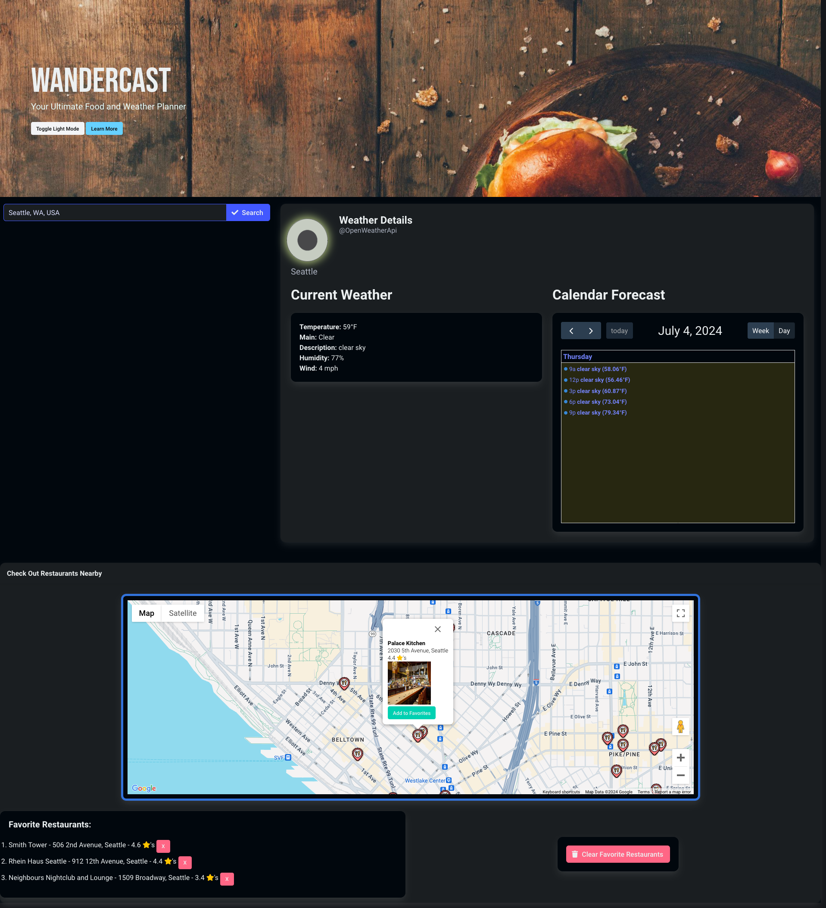

#### P1-Wander-Cast
# Wander Cast

## Project Description

WanderCast is a web application that combines weather forecasts and local dining options into one seamless tool. Users can input a city to get the current weather and nearby restaurant recommendations. The app aims to streamline the planning process for outdoor adventures by providing relevant weather information and dining options.

## Features

- **Weather Updates**: Fetches and displays the current weather for the searched city using the OpenWeatherMap API.
- **Restaurant Finder**: Uses the Google Maps Places API to find and display restaurants near the searched city.
- **Favorite Management**: Allows users to add restaurants to a favorites list, which is stored in local storage.
- **Light/Dark Mode**: Toggle between light and dark themes.
- **Responsive Design**: Ensures the application is usable on both desktop and mobile devices.

## Usage

1. **Search for a City**: Enter a city name in the search bar and click "Search" to get the current weather and nearby restaurant recommendations.
2. **View Weather Details**: See the current temperature, main weather condition, and a brief description.
3. **Explore Restaurants**: View restaurants on the map and click markers to get more details.
4. **Manage Favorites**: Add restaurants to your favorites list and view or delete them as needed.
5. **Toggle Light/Dark Mode**: Click the "Toggle Dark Mode" button to switch between light and dark themes.
6. **Learn More**: Click the "Learn More" button to read about the app's features and usage tips in a modal.

## Deployed Page

[Deployed GitHub Page](https://lixiviate.github.io/P1-Wander-Cast/)

## Source Code

- Created by:
  - [Hamszn](https://github.com/Hamszn)
  - [Lixiviate](https://github.com/Lixiviate)
  - [mlipscomb24](https://github.com/mlipscomb24)

## References

- [Bulma CSS Framework](https://bulma.io/)
- [Google Maps Documentation](https://developers.google.com/maps/documentation)
- [Open Weather Map](https://openweathermap.org/)
- [MDN Web Docs](https://developer.mozilla.org/en-US/)
- [W3 Schools](https://www.w3schools.com/)
- [edX Xpert Learning Assistant](https://www.edx.org/)